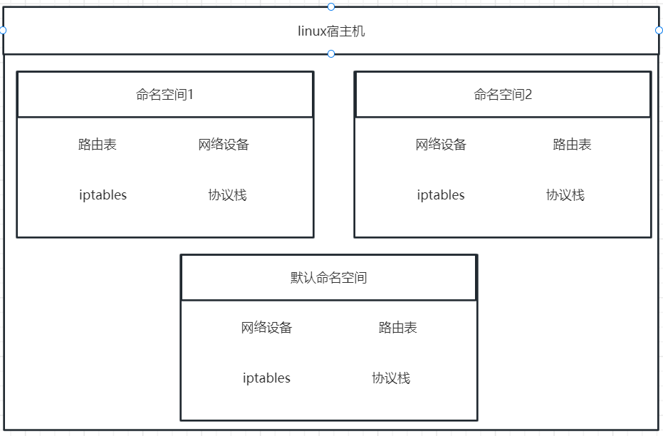
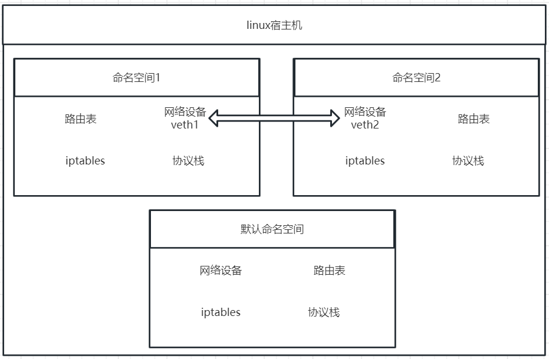
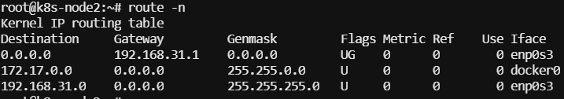

[TOC]

## 1.1、linux网络命名空间

名称空间将全局系统资源包装在一个抽象中，使名称空间中的进程看起来拥有自己的全局资源的独立实例。对全局资源的更改对作为命名空间成员的其他进程可见，但对其他进程不可见。名称空间的一个用途是实现容器。

在 Linux 中，网络名字空间可以被认为是隔离的拥有单独网络栈（网络设备、路由表、iptables、协议栈）的环境。网络名字空间经常用来隔离网络设备和服务，只有拥有同样网络名字空间的设备，才能看到彼此。



#### 基本操作：

##### 查看网络命名空间
```
ip netns list
```
##### 添加网络命名空间
```
ip netns add test1
```
##### 删除网络命名空间
```
ip netns delete test1
```
##### 进入命名空间查看ip信息
```
ip netns exec test1 ip a
```
#####  启动命名空间网络
```
# 开启网络命名空间 test1 lo 端口
ip netns exec test1 ip link set dev lo up
```

## 1.2、veth 虚拟网卡接口
veth设备是虚拟网络设备。它们可以充当网络命名空间之间的隧道，以创建到另一个命名空间中的物理网络设备的桥。 veth设备总是成对互连，网络空间比喻成两个水池的话，veth就是连接水池的管道，有了管道，两个水池的水才能相互流通



#### 基本操作：
##### 创建一对veth
```
#ip link add 第一个veth名称 type veth peer name 第二个veth名称
ip link add veth-test1 type veth peer name veth-test2
```

##### veth绑定到命名空间
```
#ip link set veth名称 netns 命名空间
ip link set veth-test1 netns test1
ip link set veth-test2 netns test2
```

##### veth添加ip地址
```
#ip netns exec 命名空间 ip addr add ip地址/24 dev veth名称
ip netns exec test1 ip addr add 192.168.1.1/24 dev veth-test1
ip netns exec test2 ip addr add 192.168.1.2/24 dev veth-test2
```

##### veth添加ip地址
```
#ip netns exec 命名空间 ip link set dev veth名称 up
ip netns exec test1 ip link set dev veth-test1 up
ip netns exec test2 ip link set dev veth-test2 up
```

## 1.3、路由表
计算机通过各个网络之间交互路由信息建立自己的路由表，ip数据报转发路径就是路由选择的结果。下面详细介绍根据现有路由表的路由规则
#### 路由表各字段说明


|  字段   | 描述  |
|  ----  | ----  |
|Destination	|目标网络或目标主机。Destination 为 default（0.0.0.0）时，表示这个是默认网关，所有数据都发到这个网关（这里是 192.168.31.1）|
|Gateway	|网关地址，0.0.0.0 表示当前记录对应的 Destination 跟本机在同一个网段，通信时不需要经过网关（同一个局域网内2台主机通信不需要经过网关）|
|Genmask	|Destination 字段的网络掩码，Destination 是主机时需要设置为 255.255.255.255，是默认路由时会设置为 0.0.0.0|
|Flags	|标志 <br>U - Up表示有效<br>G - Gateway表示连接路由，若无这个字段表示直连目的地址<br>H - Host表示目标是具体主机，而不是网段<br>R 恢复动态路由产生的表项<br>D 由路由的后台程序动态地安装<br>M 由路由的后台程序修改<br>! 拒绝路由
|Metric	 |路由距离，到达指定网络所需的中转数，是大型局域网和广域网设置所必需的 （不在Linux内核中使用。）
|Ref	 |路由项引用次数 （不在Linux内核中使用。）
|Use	 |此路由项被路由软件查找的次数
|Iface	 |网卡名字，例如 enp0s3；要去往这个网段需要使用哪一个网络接口。也就是enp0s3这张网卡

#### linux路由的种类
##### 1、主机路由，路由表中指向单个 IP 地址或主机名的路由记录，其 Flags 字段为 H。下面示例中，对于 10.0.0.10 这个主机，通过网关 10.139.128.1 网关路由：
```
[root@VM_139_74_centos ~]# route -n
Kernel IP routing table
Destination     Gateway         Genmask         Flags Metric Ref    Use Iface
10.0.0.10       10.139.128.1    255.255.255.255 UGH   0      0        0 eth0
```
##### 2、网络路由，主机可以到达的网络。下面示例中，对于 10.0.0.0/24 这个网络，通过网关 10.139.128.1 网关路由：
```
[root@VM_139_74_centos ~]# route -n
Kernel IP routing table
Destination     Gateway         Genmask         Flags Metric Ref    Use Iface
10.0.0.0        10.139.128.1    255.255.255.0   UG    0      0        0 eth0
```

##### 3、默认路由，当目标主机的 IP 地址或网络不在路由表中时，数据包就被发送到默认路由（默认网关）上。默认路由的 Destination 是 default 或 0.0.0.0。
```
[root@VM_139_74_centos ~]# route
Kernel IP routing table
Destination     Gateway         Genmask         Flags Metric Ref    Use Iface
default         gateway         0.0.0.0         UG    0      0        0 eth0
```

#### 基本操作
```
选项:

-A：设置地址类型
-C：打印 Linux 内核的路由缓存
-v：显示详细信息
-n：不执行 DNS 反向查找，直接显示数字形式的 IP 地址
-e：netstat 格式显示路由表
-net：到一个网络的路由表
-host：到一个主机的路由表
参数：

add：增加路由记录
del：删除路由记录
target：目的网络或目的主机
gw：设置默认网关
mss：设置TCP的最大区块长度（MSS），单位MB
window：指定通过路由表的TCP连接的TCP窗口大小
dev：路由记录所表示的网络接口
```
##### 1、添加主机路由，添加主机路由时，需要指定网络 ID 和主机 ID，此时需要设置 netmask 255.255.255.255：
```
[root@VM_139_74_centos ~]# route add -net 10.0.0.10 netmask 255.255.255.255 gw 10.139.128.1 dev eth0
[root@VM_139_74_centos ~]# route -n
Kernel IP routing table
Destination     Gateway         Genmask         Flags Metric Ref    Use Iface
10.0.0.10       10.139.128.1    255.255.255.255 UGH   0      0        0 eth0
```
##### 2、添加网络路由，添加网络路由时，只需指定网络 ID，通过 netmask 设置掩码长度：
```
[root@VM_139_74_centos ~]# route add -net 10.0.0.0 netmask 255.255.255.0 gw 10.139.128.1 dev eth0
[root@VM_139_74_centos ~]# route -n
Kernel IP routing table
Destination     Gateway         Genmask         Flags Metric Ref    Use Iface
10.0.0.0        10.139.128.1    255.255.255.0   UG    0      0        0 eth0
```
##### 3、添加同一个局域网的主机，不指定 gw 选项时，添加的路由记录不使用网关：
```
[root@VM_139_74_centos ~]# route add -net 224.0.0.0 netmask 240.0.0.0 dev eth0
[root@VM_139_74_centos ~]# route -n
Kernel IP routing table
Destination     Gateway         Genmask         Flags Metric Ref    Use Iface
224.0.0.0       0.0.0.0         240.0.0.0       U     0      0        0 eth0
```
##### 4、屏蔽路由
```
[root@VM_139_74_centos ~]# route add -net 224.0.0.0 netmask 240.0.0.0 reject
[root@VM_139_74_centos ~]# route -n
Kernel IP routing table
Destination     Gateway         Genmask         Flags Metric Ref    Use Iface
224.0.0.0       -               240.0.0.0       !     0      -        0 -
```
##### 5、删除可用路由
```
route del -net 224.0.0.0 netmask 240.0.0.0
```
##### 6、删除屏蔽路由
```
route del -net 224.0.0.0 netmask 240.0.0.0 reject
```
##### 7、删除和添加设置默认网关，添加或删除默认网关时，Linux 会自动检查网关的可用性：
```
[root@VM_139_74_centos ~]# route add default gw 192.168.1.1
SIOCADDRT: Network is unreachable
[root@VM_139_74_centos ~]# route del default gw 192.168.1.1
SIOCDELRT: No such process
```

## 1.4、网桥
同 veth-pair 一样，Bridge 也是一种虚拟网络设备，所以具备虚拟网络设备的所有特性，比如可以配置 IP、MAC 等。

除此之外，Bridge 还是一个交换机，具有交换机所有的功能。

对于普通的网络设备，就像一个管道，只有两端，数据从一端进，从另一端出。而 Bridge 有多个端口，数据可以从多个端口进，从多个端口出。

其工作方式非常类似于物理的网络交换机设备。Linux Bridge可以工作在二层，也可以工作在三层，默认工作在二层。工作在二层时，可以在同一网络的不同主机间转发以太网报文；一旦你给一个Linux Bridge分配了IP地址，也就开启了该Bridge的三层工作模式。在Linux下，你可以用iproute工具包或brctl命令对Linux bridge进行管理。

Bridge 的这个特性让它可以接入其他的网络设备，比如物理设备、虚拟设备、VLAN 设备等。Bridge 通常充当主设备，其他设备为从设备，这样的效果就等同于物理交换机的端口连接了一根网线。比如下面这幅图通过 Bridge 连接两个 VM 的 tap 虚拟网卡和物理网卡 eth0。